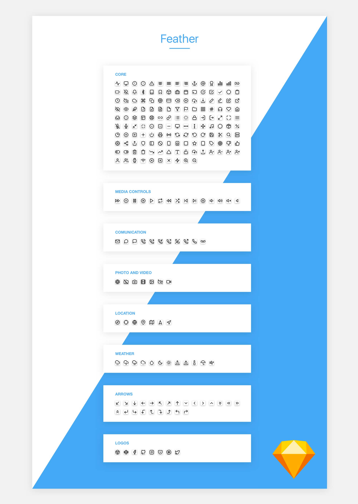

# Feather Font

> This is a iconfont version of Feather. Thanks to [colebemis](https://github.com/colebemis) for the great work!

## What is Feather?

Feather is a collection of **simply beautiful open source icons**. Each icon is designed on a 24x24 grid with an emphasis on simplicity, consistency and readability.

**[feathericons.com](https://feathericons.com)**

## What is Feather Font?

Feather font is icon font for websites, apps. It gives you scalable vector icons that can instantly be customized -- size, color, drop shadow, and anything that can be done with the power of CSS.

## Quote as Font-class

Font-class is one kind of derived usage of Unicode, which solved the problems of intuitive writing and semantic ambiguity

Compared with Unicode, its characteristics as following:
- Good compatibility, it supports IE 8+ and all usual browsers.
- When you want to change one icon, you just need to alter the quote of Unicode in class, because it define icons by “class”.
- But its one kind of font essentially, it can not support multi-color icon as well.

## Usage

1. Define the Feather font

```css
@font-face {
  font-family: "feather";
  src: url('iconfont.eot?t=1501834582692'); /* IE9*/
  src: url('iconfont.eot?t=1501834582692#iefix') format('embedded-opentype'), /* IE6-IE8 */
  url('iconfont.woff?t=1501834582692') format('woff'), /* chrome, firefox */
  url('iconfont.ttf?t=1501834582692') format('truetype'), /* chrome, firefox, opera, Safari, Android, iOS 4.2+*/
  url('iconfont.svg?t=1501834582692#feather') format('svg'); /* iOS 4.1- */
}
```

2. Define the style of iconfont usage

```css
.icon {
  /* use !important to prevent issues with browser extensions that change fonts */
  font-family: 'feather' !important;
  speak: none;
  font-style: normal;
  font-weight: normal;
  font-variant: normal;
  text-transform: none;
  line-height: 1;

  /* Better Font Rendering =========== */
  -webkit-font-smoothing: antialiased;
  -moz-osx-font-smoothing: grayscale;
}
```

3. Copy the individual code of icon into pages.

```html
<i class="icon icon-xxx"></i>
```

## Use CDN

If you intend to use Feather Font with a CDN, you can load the css from a CDN provider.

```html
<link rel="stylesheet" type="text/css" href="//at.alicdn.com/t/font_o5hd5vvqpoqiwwmi.css">
```

And then use the `feather` and `icon-xxx` class

```html
<i class="feather icon-xxx></i>
```

> the name of `icon-xxx`, you can check the document above.

## Sketch Document



Sketch document in `src/feather.sketch`

## [License](LICENSE)
